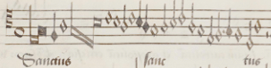
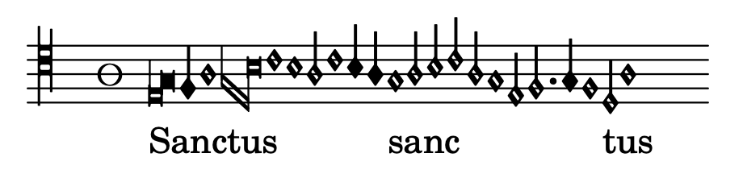
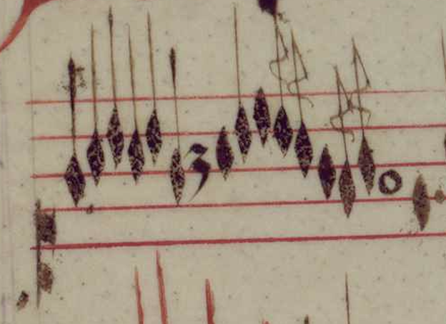
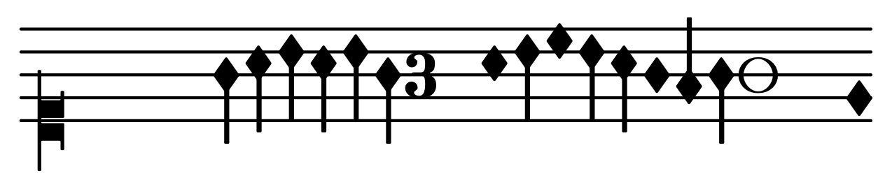

# EARLY. Employing generative layout elements for early music digital engravings.

This documents presents findings of my student elective project. The project is focused on exploring generative techniques with regards to digital engraving of early music document (music scores in mensural notation).

## Introduction

Western sheet music notation is heavily standardised. Thanks to this feature, various software like Sibelius, Finale, Dorico and Lilypond exists that allow for creating scores with an out-of-the-box high quality layout.

This is however not the case if one would like to typeset (or digitally _engrave_) an early music source. Older music, usually written using mensural notation, even though showcasing a surprisingly high level of standarization, uses very different typographic conventions. Apart from the obvious dissimilarities like presenting the piece in a form of choirbook rather than score or lack of barlines organizing verticalities, the most challenging differences from the modern typesetting software perspective lies in an entirely different approach to note spacing. This includes:
1) lack of precise vertical alignment of voices;
2) tight horizontal spacing, most often disregarding note durations;
3) extensive usage of ligatures (conjoined noteheads).

Proffessionals performing early music often tend to use facsimile editions or scans of the original sources. This approach, while allowing not to burn bridges to the early music notation intricacies, is often obscured if the source is worn-out or defective (often containing blunt mistakes). Although rewriting software by hand within those circles is not uncommon, a flexible software would definitely provide merits of another kind.

## Choosing right tool for the task.

As was already mentioned, modern market offers various music typesetting software:
1) Proprietary music typesetting apps like Dorico, Finale, Sibelius,
2) Open-source solutions MuseScore and Lilypond,
3) Projects focused on early music typesetting exclusively like Early Notation Typesetter (focused on XVI-century movable type printing style) or Gregorio (for Gregorian chant)
4) Research-oriented MEI or \*kern formats compatible with Verovio browser plugins.

The industry standard tools usually offer some kind of support for early music typesetting, however results are often it is often limited or relying on hacks. On the other hand, specialized software tend to focus only on a certain early music era or tradition, making it hard or impossible to adjust it for seemingly similar tasks.

Many of the mentioned softwares offer some kind of extendibility via scripting. Such a feature would be a definitely the way to go when building a tool for early music notation. This category definitely has a champion. Lilypond is a Dutch text-based software developed in late 90s by Han-Wen Nienhuys and Jan Nieuwenhuizen. Beign a part of the GNU project, it uses Guile Scheme as its extension language allowing for deep modification of the typesetting translation process.

Big part of my student project was to familiarize myself deeper with Lilypond's architecture and internals, studying official manuals, unofficial guides and the source code itself (written in C++ and Scheme):
1) [Official repository][https://savannah.gnu.org/projects/lilypond]
2) [Contributor's guide][https://lilypond.org/doc/v2.23/Documentation/contributor/]
1) [Documentation of the internals][https://lilypond.org/doc/v2.24/Documentation/internals/scheme-functions]
2) [Unofficial extending guide by Jean Abou Samra][https://extending-lilypond.gitlab.io/en/index.html]

The goal is to create a set of Lilypond macra that would both facilitate working with mensural notation and help to produce an output that is more within the spirit of early music notation.

## How typesetting in Lilypond works

In Lilypond, user encodes the music information within a high-level text interface encapsulating all the Scheme code into a user-friendly idioms.




```ly
<<
\new PetrucciStaff \new PetrucciVoice = "Tenor" \relative {

	% Beginning of Tenor from
	% Ockeghem's Missa Mi-Mi (Sanctus)
	% using Vanilla LilyPond.

	\override Score.SpacingSpanner.packed-spacing = ##t
	\override PetrucciStaff.TimeSignature.style = #'mensural
	\override Lyrics.LyricText.X-extent = #'(0 . 0)
	\stemUp

	\clef "petrucci-c4"
	\time 3/2

	\[ e1\melisma
	   \once \override NoteHead.style = #'blackpetrucci
	   g1*3/4 \]
	f4
	a1
	\[ g1
		\once \override NoteHead.ligature-flexa = ##t
	   d1*2
	   b'\breve \] c1
	b1 a2 c1 b4 a\melismaEnd
	
	g1\melisma a2 b
	c2 a g1 e2 f2.
	 g4 f1\melismaEnd d2\melisma
	a'1\melismaEnd
	s4

}
\new Lyrics \lyricsto "Tenor" { Sanctus ſanc tus }
>>
```

Lilypond takes several steps in order to produce an output file (usually a PDF) from it's source-code file (with .ly extension). This process is called *translation*.

The first step – *parsing* – checks the validity of syntax and turns all the valid input into *music expressions* represented as Scheme alists (keyed list of lists). Procedures that transform the music expressions are called *music functions* and they are executed on this stage (e.g. changing *music properties* of the music expressions).

```lisp
; The same, but as a scheme
; music representation.
(make-music
  'ContextSpeccedMusic
  'create-new
  #t
  'property-operations
  '()
  'context-type
  'PetrucciStaff
  'element
  (make-music
    'ContextSpeccedMusic
    'create-new
    #t
    'property-operations
    '()
    'context-id
    "Tenor"
    'context-type
    'PetrucciVoice
    'element
    (make-music
      'RelativeOctaveMusic
      'element
      (make-music
        'SequentialMusic
        'elements
        (list (make-music
                'ContextSpeccedMusic
                'context-type
                'Score
                'element
                (make-music
                  'OverrideProperty
                  'pop-first
                  #t
                  'grob-value
                  #t
                  'grob-property-path
                  (list 'packed-spacing)
                  'symbol
                  'SpacingSpanner))
              (make-music
                'ContextSpeccedMusic
                'context-type
                'PetrucciStaff
                'element
                (make-music
                  'OverrideProperty
                  'pop-first
                  #t
                  'grob-value
                  'mensural
                  'grob-property-path
                  (list 'style)
                  'symbol
                  'TimeSignature))
              (make-music
                'ContextSpeccedMusic
                'context-type
                'Lyrics
                'element
                (make-music
                  'OverrideProperty
                  'pop-first
                  #t
                  'grob-value
                  (cons 0 0)
                  'grob-property-path
                  (list 'X-extent)
                  'symbol
                  'LyricText))
              (make-music
                'ContextSpeccedMusic
                'context-type
                'Bottom
                'element
                (make-music
                  'OverrideProperty
                  'pop-first
                  #t
                  'grob-value
                  1
                  'grob-property-path
                  (list 'direction)
                  'symbol
                  'Stem))
              (make-music
                'ContextSpeccedMusic
                'context-type
                'Staff
                'element
                (make-music
                  'SequentialMusic
                  'elements
                  (list (make-music
                          'PropertySet
                          'value
                          "clefs.petrucci.c4"
                          'symbol
                          'clefGlyph)
                        (make-music
                          'PropertySet
                          'value
                          2
                          'symbol
                          'middleCClefPosition)
                        (make-music
                          'PropertySet
                          'value
                          2
                          'symbol
                          'clefPosition)
                        (make-music
                          'PropertySet
                          'value
                          0
                          'symbol
                          'clefTransposition)
                        (make-music
                          'PropertySet
                          'value
                          'default
                          'symbol
                          'clefTranspositionStyle)
                        (make-music
                          'ApplyContext
                          'procedure
                          ly:set-middle-C!))))
              (make-music
                'TimeSignatureMusic
                'beat-structure
                '()
                'denominator
                2
                'numerator
                3)
              (make-music 'LigatureEvent 'span-direction -1)
              (make-music
                'NoteEvent
                'duration
                (ly:make-duration 0)
                'pitch
                (ly:make-pitch -1 2))
              (make-music
                'ContextSpeccedMusic
                'context-type
                'Bottom
                'element
                (make-music
                  'PropertySet
                  'value
                  #t
                  'symbol
                  'melismaBusy))
              (make-music
                'ContextSpeccedMusic
                'context-type
                'Bottom
                'element
                (make-music
                  'OverrideProperty
                  'once
                  #t
                  'pop-first
                  #t
                  'grob-value
                  'blackpetrucci
                  'grob-property-path
                  (list 'style)
                  'symbol
                  'NoteHead))
              (make-music
                'NoteEvent
                'duration
                (ly:make-duration 0 0 3/4)
                'pitch
                (ly:make-pitch -1 4))
              (make-music 'LigatureEvent 'span-direction 1)
              (make-music
                'NoteEvent
                'duration
                (ly:make-duration 2)
                'pitch
                (ly:make-pitch -1 3))
              (make-music
                'NoteEvent
                'duration
                (ly:make-duration 0)
                'pitch
                (ly:make-pitch -1 5))
              (make-music 'LigatureEvent 'span-direction -1)
              (make-music
                'NoteEvent
                'duration
                (ly:make-duration 0)
                'pitch
                (ly:make-pitch -1 4))
              (make-music
                'ContextSpeccedMusic
                'context-type
                'Bottom
                'element
                (make-music
                  'OverrideProperty
                  'once
                  #t
                  'pop-first
                  #t
                  'grob-value
                  #t
                  'grob-property-path
                  (list 'ligature-flexa)
                  'symbol
                  'NoteHead))
              (make-music
                'NoteEvent
                'duration
                (ly:make-duration 0 0 2)
                'pitch
                (ly:make-pitch -1 1))
              (make-music
                'NoteEvent
                'duration
                (ly:make-duration -1)
                'pitch
                (ly:make-pitch -1 6))
              (make-music 'LigatureEvent 'span-direction 1)
              (make-music
                'NoteEvent
                'duration
                (ly:make-duration 0)
                'pitch
                (ly:make-pitch 0 0))
              (make-music
                'NoteEvent
                'duration
                (ly:make-duration 0)
                'pitch
                (ly:make-pitch -1 6))
              (make-music
                'NoteEvent
                'duration
                (ly:make-duration 1)
                'pitch
                (ly:make-pitch -1 5))
              (make-music
                'NoteEvent
                'duration
                (ly:make-duration 0)
                'pitch
                (ly:make-pitch 0 0))
              (make-music
                'NoteEvent
                'duration
                (ly:make-duration 2)
                'pitch
                (ly:make-pitch -1 6))
              (make-music
                'NoteEvent
                'pitch
                (ly:make-pitch -1 5)
                'duration
                (ly:make-duration 2))
              (make-music
                'ContextSpeccedMusic
                'context-type
                'Bottom
                'element
                (make-music 'PropertyUnset 'symbol 'melismaBusy))
              (make-music
                'NoteEvent
                'duration
                (ly:make-duration 0)
                'pitch
                (ly:make-pitch -1 4))
              (make-music
                'ContextSpeccedMusic
                'context-type
                'Bottom
                'element
                (make-music
                  'PropertySet
                  'value
                  #t
                  'symbol
                  'melismaBusy))
              (make-music
                'NoteEvent
                'duration
                (ly:make-duration 1)
                'pitch
                (ly:make-pitch -1 5))
              (make-music
                'NoteEvent
                'pitch
                (ly:make-pitch -1 6)
                'duration
                (ly:make-duration 1))
              (make-music
                'NoteEvent
                'duration
                (ly:make-duration 1)
                'pitch
                (ly:make-pitch 0 0))
              (make-music
                'NoteEvent
                'pitch
                (ly:make-pitch -1 5)
                'duration
                (ly:make-duration 1))
              (make-music
                'NoteEvent
                'duration
                (ly:make-duration 0)
                'pitch
                (ly:make-pitch -1 4))
              (make-music
                'NoteEvent
                'duration
                (ly:make-duration 1)
                'pitch
                (ly:make-pitch -1 2))
              (make-music
                'NoteEvent
                'duration
                (ly:make-duration 1 1)
                'pitch
                (ly:make-pitch -1 3))
              (make-music
                'NoteEvent
                'duration
                (ly:make-duration 2)
                'pitch
                (ly:make-pitch -1 4))
              (make-music
                'NoteEvent
                'duration
                (ly:make-duration 0)
                'pitch
                (ly:make-pitch -1 3))
              (make-music
                'ContextSpeccedMusic
                'context-type
                'Bottom
                'element
                (make-music 'PropertyUnset 'symbol 'melismaBusy))
              (make-music
                'NoteEvent
                'duration
                (ly:make-duration 1)
                'pitch
                (ly:make-pitch -1 1))
              (make-music
                'ContextSpeccedMusic
                'context-type
                'Bottom
                'element
                (make-music
                  'PropertySet
                  'value
                  #t
                  'symbol
                  'melismaBusy))
              (make-music
                'NoteEvent
                'duration
                (ly:make-duration 0)
                'pitch
                (ly:make-pitch -1 5))
              (make-music
                'ContextSpeccedMusic
                'context-type
                'Bottom
                'element
                (make-music 'PropertyUnset 'symbol 'melismaBusy))
              (make-music
                'SkipEvent
                'duration
                (ly:make-duration 2)))))))
```

The next stage is *translation* sensu stricto. This is when the Scheme lists are turned into *events*. Events are C++ objects (accessible from Scheme) that contain the information used by the backend to generate the graphical output.

Events are interpreted within *contexts*. In this example, we have the explicit _PetrucciVoice_ within the _PetrucciStaff_ and _Lyrics_ contexts, that are themselves nested within the implicit _Score_ context.

Soon, the *graphical objects* (or *grobs*) are going to emerge from events. The ultimate information about all the grobs come not only from events interpreted within their contexts, but also from the relationship between the emerging grobs themselves. An entity that coordinates this complicated process is called *translator*. There are many translators responsible for various tasks, most of which is related to appearance of grobs, line-breaking, spacing and collision-handling.

Further stages of the document compiling process are related to spacing details and we don't have to delve into them. For us now, the most important thing is the chain: **Music->Events->Grobs**. Implementing tools for mensural notation require an investigation on which level we need to operate. All the implementation will be done in Scheme.


## Early – a package of Lilypond extensions facilitating working with mensural notation.

Even though LilyPond contains many out-of-the-box solutions for mensural music (like _PetrucciStaff_ context), many of those features still require advanced tweaks due to the default target of modern music notation. The following example illustrates such a problematic situation:




Having generated grobs with custom features (flags and )


